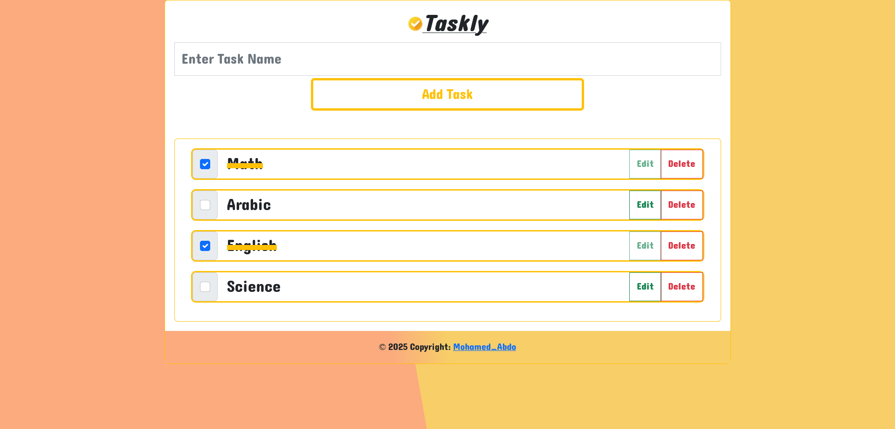

# To Do App (Taskly)

## Table of contents

- [Overview](#overview)
  - [The challenge](#the-challenge)
  - [Screenshot](#screenshot)
  - [Links](#links)
- [My process](#my-process)
  - [Built with](#built-with)
  - [What I learned](#what-i-learned)
  - [Continued development](#continued-development)
  - [Useful resources](#useful-resources)
- [Author](#author)
- [Acknowledgments](#acknowledgments)

**Note: Delete this note and update the table of contents based on what sections you keep.**

## Overview

### The App

Users should be able to:

- Do CRUDS Operations on tasks:
- Create: Add New Tasks To The List.
- Read: Show All Tasks.
- Update: Edit Any Task Name.
- Delete: Delete Any Task.
- Store: Save Task List in LocalStorage.

### Screenshot

### Links

- Solution URL: [Solution](https://github.com/UMo0HU/advice-generator-app-main)
- Live Site URL: [Live Site](https://umo0hu.github.io/advice-generator-app-main/)

## My process

### Built with

- Semantic HTML5 markup
- CSS custom properties
- JavaScript
- BootStrap5
- SweetAlert2